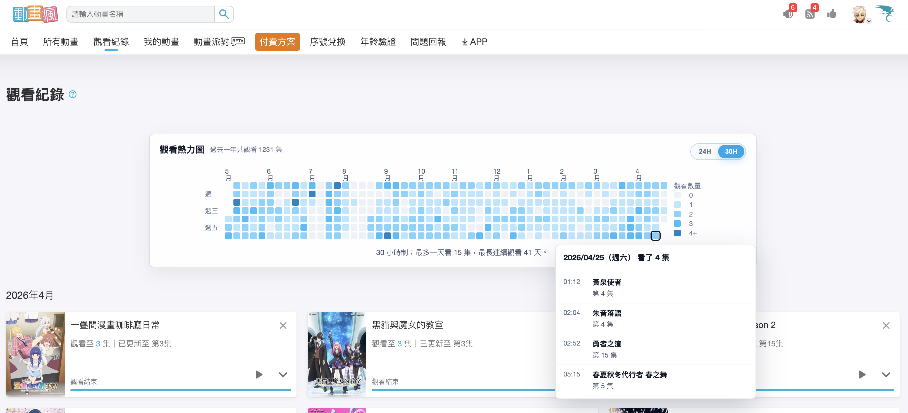

# Bahamut Anime Watch Heatmap

Browser extension for `ani.gamer.com.tw` that adds a yearly heatmap above the watch history page.

Hovering a heatmap day shows the watched titles, episode labels, and watch times for that day.

Privacy policy: [PRIVACY.md](./PRIVACY.md)



## Development

```sh
pnpm install
pnpm typecheck
pnpm build
```

## Package for Publishing

```sh
pnpm package
```

The publishable browser extension zip is written to `release/`.
Upload that zip in the Chrome Web Store Developer Dashboard.

Chrome Web Store listing assets are in `assets/store-listing/chrome/`:

- `small-promo-440x280.png`
- `marquee-1400x560.png`
- `screenshot-1280x800.png`

Run `pnpm assets:store` to regenerate the extension icons and crop the store listing images from `assets/screenshot.png`.

## Load Locally

1. Run `pnpm build`.
2. Open Chrome or Edge extension settings.
3. Enable developer mode.
4. Load the generated `dist/` directory as an unpacked extension.
5. Visit the [Bahamut Anime watch history page](https://ani.gamer.com.tw/viewList.php) while logged in.
